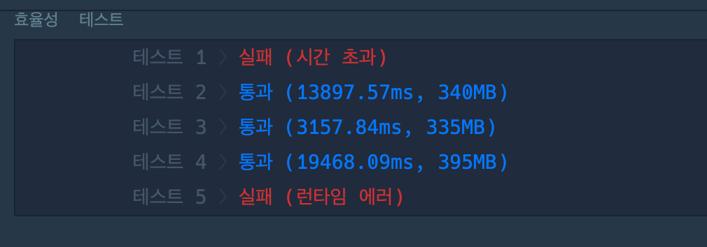

<!-- @format -->

# week 6

## 블록\_이동하기.py

로봇이 두 자리를 갖고 있어서 좀 까다로운 문제였다.

나는 항상 왼쪽위의 위치를 가지고, 모드라는 변수를 이용해 로봇이 차지하고 있는 칸을 나타내었다.

모드 0 이면 가로 모드 이다. 로봇의 현 위치가 (1, 2) 이라면 (1, 2), (1, 3) 이렇게 두개의 칸을 차지하고 있는 상태

반대로 모드 1이면 세로이고, 위치가 (1, 2)라면 (1, 2), (1, 3) 이렇게 두 칸을 차지하고 있는 상태를 나타내었다.

rotate를 하게 되면, 모드가 toggle되고 위치를 갱신해주어야 한다는 점을 유의하며 풀었다.

이렇게 구현하고 나서 bfs를 이용하여 최단거리를 계산하면 된다.

코드가 길다보니 mode^1을해서 넣는다던지 하는 자잘한 실수들을 많이 했다....

## 괄호\_변환.py

이거는 그냥 하란대로 하면 쉽게 풀린다.

## 가사\_검색.py

먼저 보자마자 트라이.. 라고 생각이 들었다.

트라이 문제를 안풀어본지 너무 오래됐으므로 예전에 짜봤던 코드를 꺼내보면서 구현했다.

물음표를 만나면 모든 자식노드로 이동하고, terminal을 만나면 1을 반환하고, 전체적으로 결과를 반환하는 형식으로 구현했다.

최적화를 한번 더 했는데, 문자열을 거꾸로 저장하는 트라이를 만들어 만약 맨 처음에 물음표가 존재한다면 거꾸로 트라이에서 찾았다. 이렇게 하면, ‘물음표가 존재하면 자식 노드의 갯수를 구하면 된다.’ 라는 한가지의 논리로 풀 수 있었다.

그러나 효율성 테케 2개가 아무리 해도... 해결이 안됐다. 실패한 코드는 다음과 같다.



```python
import sys
sys.setrecursionlimit(10**6)

from collections import deque

class Node(object):
    def __init__(self, key):
        self.key = key
        self.is_terminal = False
        self.child_num = 0
        self.children = {}

    def search(self, string, level):
        node = self
        if level == len(string):
            if node.is_terminal:
                return 1
            return 0

        ret = 0
        char = string[level]
        if char == '?':
            for key in node.children:
                ret += node.children[key].search(string, level+1)

        else:
            if char in node.children:
                ret += node.children[char].search(string, level+1)

        return ret

class Trie(object):
    def __init__(self):
        self.head = Node(None)
        self.cnt = [0 for _ in range(10000)]

    def insert(self, string):
        node = self.head

        for char in string:
            if char not in node.children:
                node.children[char] = Node(char)
            node = node.children[char]
        node.is_terminal = True

    def search(self, string):
        root_node = self.head
        return root_node.search(string, 0)

    def set_child_num(self):
        node = self.head

        q = deque()
        q.append([0, node])

        while q:
            level, node = q.popleft()
            if node.is_terminal:
                self.cnt[level] += 1
            for child in node.children:
                q.append([level+1, node.children[child]])

    def traverse(self, node, level):
        ret = 0
        if level == 1:
            for child in node.children:
                c_node = node.children[child]
                if c_node.is_terminal:
                    ret += 1

            return ret

        for child in node.children:
            c_node = node.children[child]
            ret += self.traverse(c_node, level-1)

        return ret

def solution(words, queries):
    root = Trie()
    rev_root = Trie()
    for word in words:
        root.insert(word.strip())
        rev_root.insert(word[::-1])

    root.set_child_num()
    answer = []
    for query in queries:
        if query[0] == '?':
            if query[-1] == '?':
                answer.append(root.cnt[len(query)])
            else:
                answer.append(rev_root.search(query[::-1]))
        else:
            answer.append(root.search(query))

    return answer
```

더이상의 아이디어가 떠오르지 않아 구글 한번 검색해보았다. 트라이의 루트를 글자수 갯수별로 나누어 생성하는 방법이 있었다.

물음표가 기존의 와일드카드와는 달리, 글자수의 개념도 포함하고 있으므로 매번 트라이의 리프노드까지 도달한 뒤, 끝났는지를 체크했는데 트라이의 루트를 글자수별로 생성한다면, 해당 노드의 자식 갯수를 반환하면 바로 정답이 도출될 것이다.

해당 노드의 자식갯수를 반환하는 방법은 생각해보았던 방법인데, ?????의 경우 5글자에서 끝나는 자식만을 반환해야하지만, 6글자짜리 노드까지도 반환이 되었었다. 이를 해결하기 위해 child[level] 등의 배열을 통한 몇번째에 끝나는 자식이 몇개인지를 따져보았는데 이는 메모리도 많이들고, 10만개의 자식이 존재할 수 있으므로 시간복잡도도 크므로 사용할 수 없었는데, 이렇게 구현한다면 가능하다고 생각이 들었다.

정답코드

```python
import sys
sys.setrecursionlimit(10**6)

from collections import deque, defaultdict

class Node(object):
    def __init__(self, key):
        self.key = key
        self.is_terminal = False
        self.child_num = 0
        self.children = {}

    def search(self, string):
        node = self
        for char in string:
            if char == '?':
                return node.child_num
            else:
                if char in node.children:
                    node = node.children[char]
                else:
                    return 0

        if node.is_terminal:
            return 1
        return 0

    def set_child_num(self):
        node = self
        if node.is_terminal:
            return 1

        num = 0
        for child in node.children:
            num += node.children[child].set_child_num()
        node.child_num = num
        return node.child_num

class Trie(object):
    def __init__(self):
        self.head = Node(None)

    def insert(self, string):
        node = self.head
        for char in string:
            if char not in node.children:
            	node.children[char] = Node(char)
            node = node.children[char]
        node.is_terminal = True

    def search(self, string):
        return self.head.search(string)

    def set_child_num(self):
        self.head.set_child_num()


def solution(words, queries):
    root = dict()
    rev_root = dict()

    for word in words:
        l = len(word)

        if l not in root:
            root[l] = Trie()
            rev_root[l] = Trie()

        root[l].insert(word)
        rev_root[l].insert(word[::-1])

    for num in root:
        root[num].set_child_num()

    for num in rev_root:
        rev_root[num].set_child_num()

    answer = []
    for query in queries:
        l = len(query)
        if l not in root:
            answer.append(0)
        elif query[0] == '?':
            query = query[::-1]
            answer.append(rev_root[l].search(query))
        else:
            answer.append(root[l].search(query))

    return answer
```

먼저 트라이를 딕셔너리를 통해 만들어주었다. 그리고 set_child_num 이라는 메서드를 만들어, 그 노드에서의 자식 노드 전체 갯수를 구하였다. 길이마다 트라이를 나누어서 따로 생성하였기 때문에, 자식 노드 갯수를 구하는 것은 별 고민 안할 수 있었다.

그러나 파이썬의 언어적 특성상 재귀가 깊어지면 오류가 나기 쉬우므로, 다음엔 전체 자식노드를 구하는 방법을 bfs를 이용해 구현해봐야겠다.
